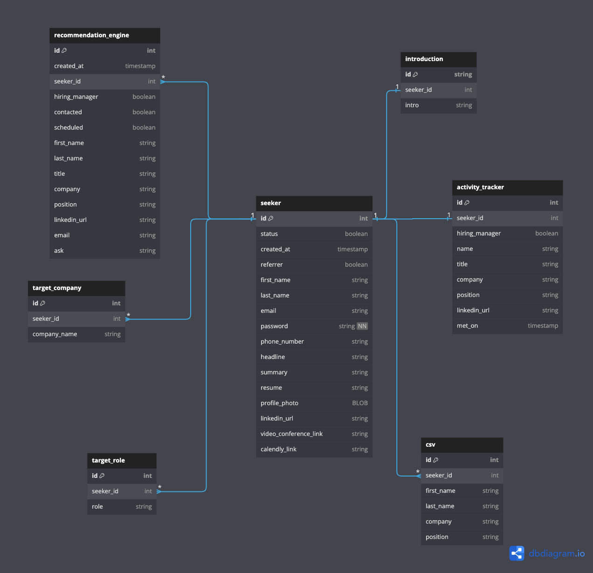

### Demo Link: TBD

#### Stack
 - Backend
   - Python/[Django](https://www.djangoproject.com/)
   - Testing -> [Django Test](https://docs.djangoproject.com/en/4.2/topics/testing/)
 - Frontend
   - [Django Template Language (DTL)](https://docs.djangoproject.com/en/4.2/topics/templates/)
   - [React with Material UI](https://mui.com/material-ui/getting-started/)
   - Testing -> Django Test / [django-test-plus](https://pypi.org/project/django-test-plus/)
 - Database
   - [Postgres](https://www.postgresql.org/)
 - CI
   - [Github Actions](https://github.com/features/actions)

#### Directories
At the base of the repo, you'll currently find the following directories:

```
theseeker_ai/
├── apps/
│   ├── seeker/
│   │   ├── migrations/
│   │       └── __init__.py
│   │   ├── __init__.py
│   │   ├── admin.py
│   │   ├── apps.py
│   │   ├── models.py
│   │   ├── tests.py
│   │   └── views.py
├── env/
│   ├── bin/
│   ├── include/
│   ├── lib/
├── images/
├── rec_eng_if_mvp/
│   ├── pycache/
│   ├── __init__.py
│   ├── asgi.py
│   ├── settings.py
│   ├── urls.py
│   └── wsgi.py
├── .gitignore
├── mnanage.py
├── README.md
└── requirements.txt
```

* `apps` - contains all of the submodules of the project. i.e <i>seeker, registration, login</i>
* `env` - the virtual environment provides an isolated and controlled environment for managing the dependencies and Python packages specific to our Django project.
* `images` - images for project
* `rec_eng_if_mvp` - is the lower-level folder that represents the management app.
* `.gitignore` - files and directories that should be ignored and not tracked by Git. 
* `manage.py` - a Python file that serves as the command center of our project. It does the same as the django-admin command-line utility.
* `README.md` - provides essential information and instructions about the project.
* `requirements.txt` - a text file that lists the Python packages and their versions required for our Django project to run correctly.

### Getting Started

You'll need to download & install a few tools before you can begin to code.
1. [Python](https://www.python.org/downloads/)

### Branching Strategy
<b>Gitflow:</b> an alternative Git branching model that involves the use of feature branches and multiple primary branches.


<br>
<br>

Install Git Graph for Visual Studio Code to help visualize our git workflow. 
https://marketplace.visualstudio.com/items?itemName=mhutchie.git-graph

### Feature Branch Naming Convention
```prefix-action-GHissuenumber```

**Example:**
```
feature-buildseekermodel-#7
```

**Prefix:**
```
feature
bugfix
hotfix
documentation
```

### Versioning Scheme
```
MAJOR.MINOR.PATCH
```

### Code Review
To initiate a code review submit a Pull Request (PR) from the current feature branch you are working on.

Follow template below when creating a PR:
Source: [Writing A Great Pull Request Description](https://www.pullrequest.com/blog/writing-a-great-pull-request-description/)
```
What?
Why?
How?
Testing?
Screenshots (optional)
Anything Else?
```

#### Database Structure
Source: [Linktag Entity Relationship Diagram (ERD)](https://dbdiagram.io/d/648bed20722eb774940fe749)


